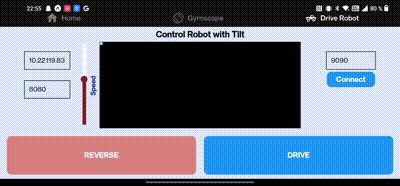

# Welcome to the AIS2203 project GUI

This application is created using the expo react-native framework and can be downloaded [here](https://expo.dev/artifacts/eas/d26KMkwMFvd5dsDfmyyRBx.apk).

## How to download the app

- Download .apk file (only for android)
- Allow your phone to install APKs by going to Settings > Apps > Menu > Special access > Install unknown apps
- Open and enjoy
- (It will not work without the Hub code/test code)

## Home Page

This is the first page of the application. It contains some information.

## Gyroscope test

In this page you can test the motion detection of your phone's rotation.

This will indicate whether your phone can be used to control the robot with pitch.

Look at the 'beta' value, and make sure it changes when the phone is rotated.

## Drive Robot

The Drive Robot page includes sending data from gyroscope, to control the heading of the robot, and drive speed. This was done over websocket using ``SimpleSocket``.
For the camera stream, a ``HTTP`` stream was created.

## "Dissapointment"

Unfortunately we did not have time to implement the communication from the Main Hub code. It would not have taken much more time as the ``cpp`` test code already had been made, and was working in a separate program.

